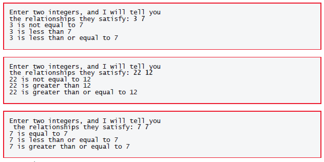

# Chapter 02

## 2.6 Decision Making: Equality and Relational Operators

A condition is an expression that can be true (that is, the condition is met) or false (that is, the condition isn’t met).

### Equality and Relational Operators

Conditions are formed using the following **equality** and **relational operators**:

|Algebraic equality or relational operator|C equality or relational operator|Sample C condition|Meaning of C condition|
|:-----------------------------------------:|:-----------------------------------:|:--------------------:|:------------------------:|
|_**Relational operators**_|
|>|>|x > y|x is greater than y|
|`<`|`<`|`(x < y)`|x is less than y|
|≥|>=|x >= y|x is greater than or equal to y|
|≤|<=|x <= y|x is less than or equal to y|
|_**Equality operators**_|
|=|==|x == y|x is equal to y|
|≠|!=|x != y|x is not equal to y|

+ The relational operators <, <=, > and >= have the same precedence and group left-toright. 
+ The equality operators == and != have the same precedence, which is lower than that of the relational operators, and also group left-to-right.
+In C, a condition may actually be any expression that generates a zero (false) or nonzero (true) value.

>[!Caution] 
>### Confusing the Equality Operator "==" with the Assignment Operator
>Confusing == with the assignment operator (=) is a common programming error. To avoid this confusion, read the equality operator as “double equals” and the assignment operator as “gets” or “is assigned the value of.” As you’ll see, confusing these operators can cause difficult-to-find logic errors rather than compilation errors.

### Demonstrating the if Statement

```C
1 // fig02_05.c
2 // Using if statements, relational
3 // operators, and equality operators.
4 #include <stdio.h>
5
6 // function main begins program execution
7 int main(void) {
8 printf("Enter two integers, and I will tell you\n");
9 printf("the relationships they satisfy: ");
10
11 int number1 = 0; // first number to be read from user
12 int number2 = 0; // second number to be read from user
13
14 scanf("%d %d", &number1, &number2); // read two integers
15
16 if (number1 == number2) {
17 printf("%d is equal to %d\n", number1, number2);
18 } // end if
19
20 if (number1 != number2) {
21 printf("%d is not equal to %d\n", number1, number2);
22 } // end if
23
24 if (number1 < number2) {
25 printf("%d is less than %d\n", number1, number2);
26 } // end if
27
28 if (number1 > number2) {
29 printf("%d is greater than %d\n", number1, number2);
30 } // end if
31
32 if (number1 <= number2) {
33 printf("%d is less than or equal to %d\n", number1, number2);
34 } // end if
35
36 if (number1 >= number2) {
37 printf("%d is greater than or equal to %d\n", number1, number2);
38 } // end if
39 } // end function main
```



### Comparing Numbers

The if statement in lines 16–18

```C

if (number1 == number2) {
printf("%d is equal to %d\n", number1, number2);
} // end if 
```

compares number1’s and number2’s values for equality. If the values are equal, line 17
displays a line of text indicating that the numbers are equal. For each true condition
in the if statements starting in lines 20, 24, 28, 32 and 36, the corresponding body
statement displays a line of text.

>[!Caution]
>Placing a semicolon immediately to the right of the right parenthesis after an if statement’s condition is a common error. In this case, the semicolon is treated as an empty statement that does not perform a task—the statement that was intended to be part of the if statement’s body no longer is and always executes.

### Operators Introduced So Far

|Operators|Grouping|
|:---------------:|:---------------:|
|()|left-to-right|
|*   /   %|left-to-right|
|+   -|left-to-right|
|<   <=   >   >=|left-to-right|
|==   !=|left-to-right|
|=|**right-to-left**|

### Keywords

Some words that we’ve used in this chapter’s examples, such as int, if and void, are **keywords** or reserved words of the language and have special meaning to the compiler. The following table contains the C keywords. Do not use them as identifiers.

|Keywords|||||
|:---------:|:---------:|:---------:|:---------:|:---------:|
|auto|do|goto|signed|unsigned|
|break|double|if|sizeof|void|
|case|else|int|static|volatile|
|char|enum|long|struct|while|
|const|extern|register|switch|continue|
|float|return|typedef|default|for|
|short|union||||
|_Keywords added in the C99 standard_|
|_Bool|_Complex|_Imaginary|inline|restrict|
|_Keywords added in the C11 standard_|
|_Alignas|_Alignof|_Atomic|_Generic|_Noreturn|
|_Static_assert|_Thread_local||||
