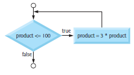

# Chapter 03

## 3.7 The `while` Iteration Statement

The __while iteration statement__ specifies that an action repeats while a condition is _true_. Eventually, the condition will become _false_. At this point, the iteration terminates, and the first statement after the iteration statement executes.

### Calculating the First Power of 3 Greater Than 100

As a while statement example, consider a program segment that finds the first power
of 3 larger than 100. The integer variable product is initialized to 3. When the following
code segment finishes executing, product will contain the desired answer:

```C
int product = 3;
while (product <= 100) {
product = 3 * product;
}
```

An action in the while statement’s body must eventually cause the condition to become false; otherwise, the loop will never terminate a __logic error__ called an __infinite loop__.

### while Statement Flowchart


