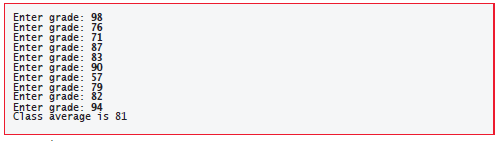

# Chapter 03

## 3.8 Formulating Algorithms Case Study 1: Counter Controlled Iteration

+ __Counter-controlled iteration__ uses a variable called a __counter__ to specify the number of times a set of statements should execute.

+ __Counter-controlled iteration__ is often called __definite iteration__ because the number of iterations is known before the loop begins executing.

### Example

A class of ten students took a quiz. The grades (integers in the range 0 to 100) for this quiz are available to you. Determine the class average on the quiz.

### Pseudocode

```Pseudocode
1 Set total to zero
2 Set grade counter to one
3
4 While grade counter is less than or equal to ten
5 Input the next grade
6 Add the grade into the total
7 Add one to the grade counter
8
9 Set the class average to the total divided by ten
10 Print the class average
```

### `C` Code

```C

// Class average program with counter-controlled iteration.
#include <stdio.h>

// function main begins program execution
int main(void) {
    // initialization phase
    int total = 0; // initialize total of grades to 0
    int counter = 1; // number of the grade to be entered next

    // processing phase
    while (counter <= 10) { // loop 10 times
    printf("%s", "Enter grade: "); // prompt for input
    int grade = 0; // grade value
    scanf("%d", &grade); // read grade from user
    total = total + grade; // add grade to total
    counter = counter + 1; // increment counter
    } // end while

    // termination phase
    int average = total / 10; // integer division
    printf("Class average is %d\n", average); // display result
} // end function main
```

### Output



+ A __total__ is a variable used to accumulate the sum of a series of values. Variables used to store totals should be initialized to zero.

+ A __counter__ is a variable used to count. Counter variables typically are initialized to zero or one, depending on their use.

+ An uninitialized variable contains a __“garbage” value__ the value last stored in the memory location reserved for that variable.
