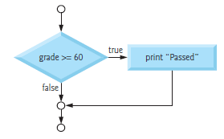

# Chapter 03

## 3.5 The `if` Selection Statement

### Example

suppose the passing grade on an exam is 60. The following pseudocode statement determines whether the condition “student’s grade is greater than or equal to 60” is true or false:

### Pseudocode

```Pseudocode
    If student’s grade is greater than or equal to 60
        Print “Passed”
```

### `C` Code

```c
if (grade >= 60) 
{
    puts("Passed");
} // end if
```

Of course, you’ll also need to declare the _int_ variable grade, but the C if statement
code corresponds closely to the pseudocode.

### Indentation in the `if` Statement

> [!Note]
> The indentation in the `if` statement’s second line is optional but highly recommended. It emphasizes the inherent structure of structured programs. The compiler ignores __white-space characters__ such as `blanks`, `tabs` and `newlines` used for indentation and vertical spacing.

### `if` Statement Flowchart



+ __The diamond (decision) symbol__ indicates that a decision is to be made.
+ __The decision symbol’s__ expression typically is a condition that can be true or false.
+ The decision symbol has two __flowlines__ emerging from it indicating the directions to take when the expression is true or false.

+ A decision can be based on any expression’s `value—zero is false and nonzero is true`.
