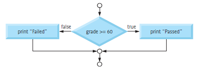
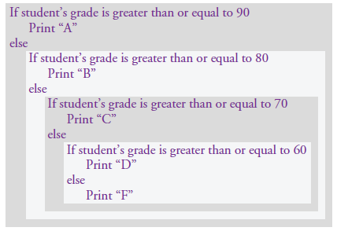
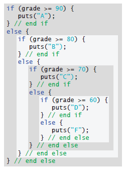

# Chapter 03

## 3.6 The `if…else` Selection Statement

The if…else selection statement specifies different actions to perform when the
condition is true or false.

### Example 01

prints “Passed” if the student’s grade is greater than or equal to 60; otherwise, it prints “Failed.” In either case, after printing, the next pseudocode statement in sequence “executes.” The else’s body also is indented.

### Pseudocode 01

```Pseudocode
    If student’s grade is greater than or equal to 60
        Print “Passed”
    else
        Print “Failed”
```

In either case, after printing, the next pseudocode statement in sequence “executes.” The else’s body also is indented.

### `C` Code 01

```c
if (grade >= 60) 
{
    puts("Passed");
} // end if
else 
{
    puts("Failed");
} // end else
```

If there are several levels of indentation in a program, each should be indented the same additional amount of space.

### `if…else` Statement Flowchart



### Conditional Expressions

+ The __conditional operator__ `(?:)` is closely related to the `if…else` statement.
+ The __conditional operator__ is C’s only _ternary operator_—it takes three operands.
    1. The first is a condition.
    1. The second is the value for the conditional expression if the condition is true.
    1. The third is the value for the conditional expression if the condition is false.

For example, the conditional-expression argument to the following puts statement evaluates to the string "Passed" if the condition grade >= 60 is true; otherwise, it evaluates to the string "Failed":

```C
    puts((grade >= 60) ? "Passed" : "Failed");
```

> [!CAUTION]
>__Conditional operators__ can be used in places where `if…else` statements cannot, including expressions and arguments to functions (such as printf). Use expressions of the same type for the second and third operands of the conditional operator (?:) to avoid subtle errors.

### Nested if...else Statements

__Nested `if…else`statements__ test for multiple cases by placing if…else statements inside if…else statements.

### Example 02

The following pseudocode statement prints: A for grades greater than or equal to 90, B for grades greater than or equal to 80 (but less than 90), C for grades greater than or equal to 70 (but less than 80), D for grades greater than or equal to 60 (but less than 70), and F for all other grades.

### Pseudocode 02



```Pseudocode
    If student’s grade is greater than or equal to 90
        Print “A”
    else
        If student’s grade is greater than or equal to 80
            Print “B”
        else
            If student’s grade is greater than or equal to 70
                Print “C”
            else
                If student’s grade is greater than or equal to 60
                    Print “D”
                else
                    Print “F”
```

### `C` Code 02



```C
if (grade >= 90) 
{
    puts("A");
} // end if
else 
{
    if (grade >= 80) 
    {
        puts("B");
    } // end if
    else 
    {
        if (grade >= 70) 
        {
            puts("C");
        } // end if
        else 
        {
            if (grade >= 60) 
            {
               puts("D");
            } // end if
            else 
            {
                puts("F");
            } // end else
        } // end else
    } // end else
} // end else
```

_Most programmers write the preceding if statement as_.

```c
if (grade >= 90) {
puts("A");
} // end if
else if (grade >= 80) {
puts("B");
} // end else if
else if (grade >= 70) {
puts("C");
} // end else if
else if (grade >= 60) {
puts("D");
} // end else if
else {
puts("F");
} // end else
```

Both forms are equivalent. The latter form avoids the deep indentation to the right,
which decreases program readability and sometimes causes lines to wrap.

### Blocks and Compound Statements

To include several statements in an if’s body, you must enclose the statements in braces ({ and }). A set of statements contained within a pair of braces is called a __compound statement__ or a __block__.

```C
if (grade >= 60) {
puts("Passed.");
} // end if
else {
puts("Failed.");
puts("You must take this course again.");
} // end else
```

>![NOTE]
> The braces surrounding the two statements in the else clause are important. Without them, the statement
>
>```C
>puts("You must take this course again.");
>```
>
>would be outside the else’s body (and outside the if…else statement) and would execute regardless of whether the grade was less than 60.

### Kinds of Errors

+ __A syntax error__ (such as misspelling “else”) is caught by the compiler.
+ __A logic error__ has its effect at execution time.
+ __A fatal logic error__ causes a program to fail and terminate prematurely.
+ __A nonfatal logic error__ allows a program to continue executing but to produce incorrect results.

### Empty Statement

```C
if (grade >= 60);
```

leads to a __logic error__ in `single-selection if` statements and a __syntax error__ in `doubleselection` and `nested if…else` statements.

>![Note]
>To solve that Type both braces of compound statements before typing the individual statements within the braces.
>This helps avoid omission of one or both of the braces, preventing syntax errors (such as an if statement whose if part has multiple statements, which requires a pair of braces) and logic errors.
