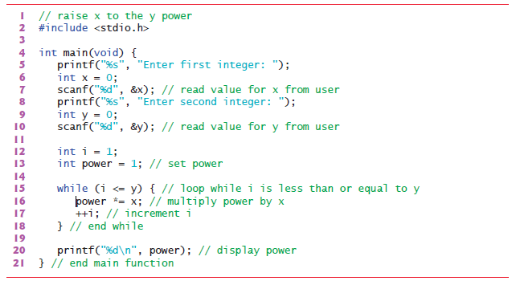

# Self-Review Exercises

## 3.1 Fill-In the blanks in each of the following questions

a) A procedure for solving a problem in terms of the actions to execute and the order in which the actions should execute is called a(n) _______ .

b) Specifying the execution order of statements by the computer is called _______.

c) All programs can be written in terms of three types of control statements: _______ , _______ and _______.

d) The _______ selection statement is used to execute one action when a condition is true and another action when that condition is false.

e) Several statements grouped together in braces ({ and }) are called a(n) _______.

f) The _______ iteration statement specifies that a statement or group of statements is to be executed repeatedly while some condition remains true.

g) Iterating a specific number of times is called _______ iteration.

h) When it’s not known in advance how many times a set of statements will be repeated, a(n) _______ value can be used to terminate the iteration.

### Answers

|||||
|:---------:|:---------:|:---------:|:---------:|
|a)`Algorithm`|b)`Program Control`|c)`Sequence`, `Selection`, `Iteration`|d)`if...else`|
|e) `Compound statement` Or `Block`|f)`While`|g)`Counter controlled` or `Definite`|h) `Sentinel`|


## 3.2 Write four different C statements that each add 1 to integer variable x

```C
    x = x + 1;
    
    x+ = 1;
    
    x++;

    ++x; 
```

## 3.3 Write a single C statement to accomplish each of the following

a) Multiply the variable product by 2 using the *= operator.

```C
    Mul*=2;
```

b) Multiply the variable product by 2 using the = and * operators.

```C
    Mul = Mul * 2;
```

c) Test whether the value of the variable count is greater than 10. If it is, print "Count is greater than 10".

```C
    if (count>10)
    {
        puts("Count is greater than 10");
    }
```

d) Calculate the remainder after quotient is divided by divisor and assign the result to quotient. Write this statement two different ways.

```C
    quotient% =  divisor ;
    quotient = quotient % divisor ; 
```

e) Print the value 123.4567 with two digits of precision. What value is printed?

```C
    printf ("%.2f\n",123.4567);  //output = 123.46
```

f) Print the floating-point value 3.14159 with

```C
    printf ("%.5f\n",3.14159);
```

## 3.4 Write a C statement to accomplish each of the following tasks

a) Define variable x to be of type int and set it to 1.
b) Define variable sum to be of type int and set it to 0.
c) Add variable x to variable sum and assign the result to variable sum.
d) Print "The sum is: " followed by the value of variable sum.

## 3.5 Combine the statements from Exercise 3.4 into a program that calculates the sum of the integers from 1 to 10. Use the while statement to loop through the calculation and increment statements. The loop should terminate when x becomes 11

## 3.6 Write single C statements to perform each of the following tasks

a) Input integer variable x with scanf. Use the conversion specification %d.

```C
    int x;
    scanf("%d",&x);
```

b) Input integer variable y with scanf. Use the conversion specification %d.

```C
    int y;
    scanf("%d",&y);
```

c) Set integer variable i to 1.

```C
    int i = 1;
```

d) Set integer variable power to 1.

```C
    int power = 1;
```

e) Multiply integer variable power by x and assign the result to power.

```C
    power = power * x ;
    //or 
    power*= x ;
```

f) Increment variable i by 1.

```C
    i++;
    //or
    ++i;
```

g) Test i to see if it’s less than or equal to y in the condition of a while statement.

```C
    while(i<=y)
    {

    }
```

h) Output integer variable power with printf.

```C
    printf ("%d",power);

```

## 3.7 Write a C program that uses the statements in the preceding exercise to calculate x raised to the y power. The program should have a while iteration control statement

```C
#include<stdio.h>

int main (void)
{
    int x;
    scanf("%d",&x);
    int y;
    scanf("%d",&y);
    int i = 1 ;
    int power = 1;

    while(i<=y)
    {
        power = power * x
        ++i;
    }

    printf ("%d",power);

}
```



## 3.8 Identify and correct the errors in each of the following

### a)

```C
    while (c <= 5)
    {
    product *= c;
    ++c;
```

```C
//Correct 
while (c <= 5)
    {
    product *= c;
    ++c;
    } // <-----------------
    /*Error: Missing the closing right brace of the while body.
      Correction: Add closing right brace after the statement ++c;.*/
```

### b)

```C
scanf("%.4f", &value);
```

```C
//Correct 
scanf("%f", &value);
 
    /*Error: Precision used in a scanf conversion specification.
      Correction: Remove .4 from the conversion specification.*/
```

### c)

```C
if (gender == 1) {
puts("Woman");
}
else; {
puts("Man");
}
```

```C
//Correct 
if (gender == 1) {
puts("Woman");
}
else; {         //<----------------- 
puts("Man");
}
    /*Error: Semicolon after the else part of the if…else statement results in a logic error. The second puts will always execute.
      Correction: Remove the semicolon after else.*/
```

## 3.9 What’s wrong with the following while iteration statement (assume z has value 100), which is supposed to calculate the sum of the integers from 100 down to 1? while (z >= 0) {sum += z;}

The value of the variable `z is never changed` in the `while` statement. Therefore, an `infinite loop` is created. To __prevent__ the `infinite loop`, `z` must be decremented so that it eventually becomes `0`.
