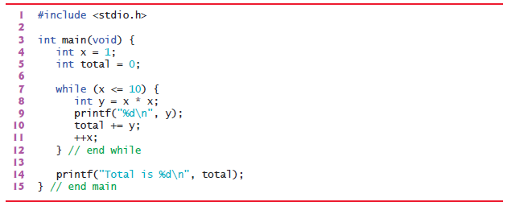

# Exercises

## 3.10 Identify and correct the errors in each of the following. [Note: There may be more than one error in each piece of code.]

__a)__:

```C
if (age >= 65); {   //  <------ ';'
puts("Age is greater than or equal to 65");
}
else {
puts("Age is less than 65");
}
```

```C
    //Error: 'else' without a previous 'if'
    //Correct: Removing ";"
if (age >= 65)
{
    puts("Age is greater than or equal to 65");
}
else 
{
    puts("Age is less than 65");
}

```

__b)__:

```C
int x = 1;
int total;
while (x <= 10) {
total += x;
++x;
}
```

```C
    //undefined value (garbage value)
    //  Correction: initialize "total=0;"
     
int x = 1;
int total;        //<------- undefined value (garbage value)
while (x <= 10) {
total += x;
++x;
}

```

__c)__:

```C
While (x <= 100)
total += x;
++x;
```

```C
    //1st Warninig: implicit declaration of function 'While'
    //  Correction: while 
    //2en no enclosing braces that will make infinite loop

    // Correct Code :
    while (x <= 100) //<-----------
    {                //<-----------
        total += x;
        ++x;
    }                //<-----------

```

__d)__:

```C
while (y > 0) {
printf("%d\n", y);
++y;
}
```

```C
    //infinite loop y will be increasing and will alwas be greater than 0
    //    Correction:   (y < any numeber) or  (--y)

while (y > 0)           //<---------------- here or 
{
    printf("%d\n", y);
    --y;//++y;         //<----------------or Here
}
```

## 3.11 Fill-In the blanks in each of the following

a) The solution to any problem involves performing a series of actions in a specific ___________.

b) A synonym for procedure is ___________.

c) A variable that accumulates the sum of several numbers is a(n) ___________.

d) A special value used to indicate “end of data entry” is called a(n)  ___________, a(n) ___________, a(n) ___________ or a(n) ___________ value.
e) A(n) ___________ is a graphical representation of an algorithm.

f) In a flowchart, the order in which the steps should be performed is indicated by ___________ symbols.

g) Rectangle symbols correspond to calculations that are normally performed by ___________ statements and input/output operations that are normally performed by calls to the ___________ and ___________ Standard Library functions.

h) The item written inside a decision symbol is called a(n) ___________.

__Answers__:

|||||
|:---------:|:---------:|:---------:|:---------:|
|__a)__`Algorithm`|__b)__`Algorithm` or `program control`|__c)__`Total`|__d)__`Sentinel value`, `signal value`, `dummy value`, `flag value`|
|__e)__`Flowchart`|__f)__`Arrow` or `Flowlines`|__g)__`Sequence`, `printf`, `scanf`|__h)__`diamond`or`decision symbol`|

## 3.12 What does the following program print?



__Answer__:

```CMD
1
4
9
16
25
36
49
64
81
100
Total is 385
```

## 3.13 Write a single pseudocode statement that indicates each of the following

__a)__ Display the message "Enter two numbers".

```pseudocode
print two numbers
```

__b)__ Assign the sum of variables x, y, and z to variable p.

```pseudocode
Add the x, y and z into the p
```

__c)__ Test the following condition in an if…else selection statement: The current value of variable m is greater than twice the current value of variable v.

```pseudocode
If variable m greater than (v*2)
```

__d)__ Obtain values for variables s, r, and t from the keyboard.

```pseudocode
input the s, r and t
```

## 3.14 Formulate a pseudocode algorithm for each of the following

__a)__ Obtain two numbers from the keyboard, compute their sum and display the result.

```pseudocode
initialize num1
initialize num2
initialize sum

input first number assined to num1
input second number assined to num2

add num1, num2 into the sum

print sum
```

__b)__ Obtain two numbers from the keyboard, and determine and display which (if either) of the two numbers is the larger.

```pseudocode
input first number assined to num1
input second number assined to num2

if num1 greater than num2
    print num1

else if num2 greater than num1
    print num2

else
    print "both number are equal"
```

__c)__ Obtain a series of positive numbers from the keyboard, and determine and display their sum. Assume that the user types the sentinel value -1 to indicate “end of data entry.”

```pseudocode
Initialize total to zero

Input the first number (possibly the sentinel)
While the user has not as yet entered the sentinel
    Add this number into the running total
    Input the next number (possibly the sentinel)

print total
```

## 3.15 State which of the following are true and which are false. If a statement is false, explain why

__a)__ Experience has shown that the most challenging part of solving a problem on a computer is producing a working C program.

__b)__ A sentinel value must be a value that cannot be confused with a legitimate data value.

__c)__ Flowlines indicate the actions to be performed.

__d)__ Conditions written inside decision symbols always contain arithmetic operators (i.e., +, -, *, /, and %).

__e)__ In top-down, stepwise refinement, each refinement is a complete representation of the algorithm.

__Answers__:

|||
|:---------:|:---------|
|__a)__|_true_|
|__b)__|_true_|
|__c)__|_false_: Flowlines indicate the order in which the actions are performed.|
|__d)__|_false_: diamond (decision) symbol indicates that a decision is to be made, andexpression typically is a condition that can be true or false.|
|__e)__|_true_|
